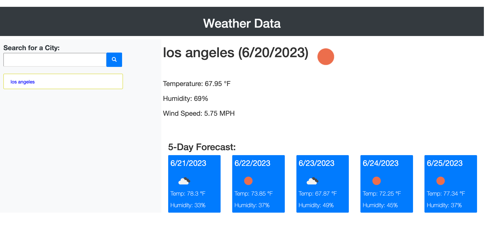

# Module-6
Module-6 challenge, weather data

## User Story

* As a traveler 
* I WANT to see the weather outlook for multiple cities
* SO THAT I can plan a trip accordingly

## Acceptance Criteria

* GIVEN a weather dashboard with form inputs

* It is done WHEN I search for a city

* It is done when I display the current and future weather conditions for that city

* It is done when that city is added to the search history

* It is done when I view the current weather for the city

* It is done when I'm presented with the city name, date, icon that represents the weather conditions, temperature, humidity and wind speed.

* It is done when I'm presented with a five day forcast for the city.

* It is done when I display the city name in the search history.

* It is done when I can click on a searched city name that is displayed.

## Resources

* YouTube Videos on coding with API

* Tutor session with James Compagnoni

* Code Academy with coding help

* W3Schools to help with coding in Javascript

* Stack Over Flow helping with coding Javascript

* Worked with three classmates on helping with coding

* Used class office hours for help with coding

* Javascript for dummies book and HTML book

* MDRN docs referenced for coding

* GIT Hub topics refrenece for coding help

## Screenshot 

